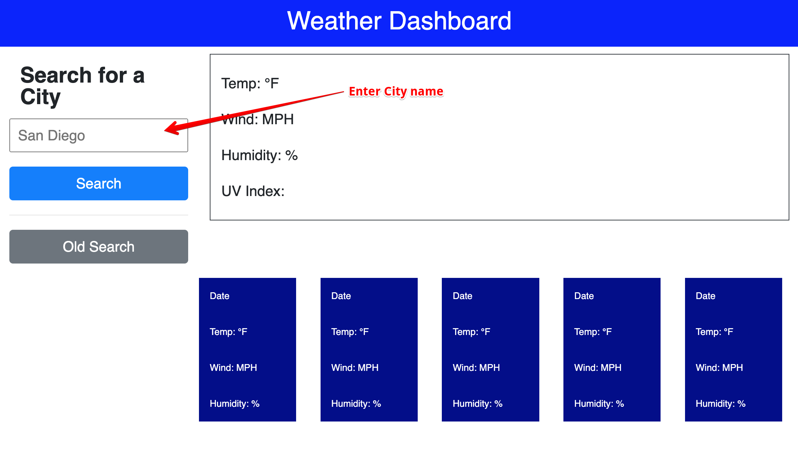
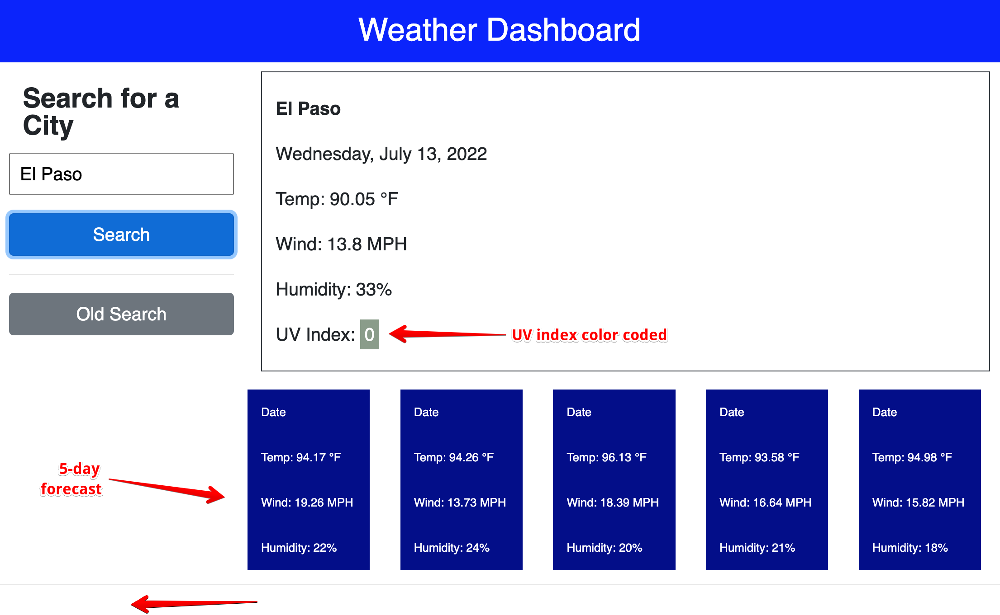

# Simple Weather Dashboard

## Deployed Website

[https://missatrox44.github.io/simple-weather-dashboard](https://missatrox44.github.io/simple-weather-dashboard)

---
## How it works
Go to deployed website, enter desired city and click search button.
  
Current weather data will be displayed as well as a 5-day forecast. The UV index will be color coded according to UV range exposure category.
  

## Bugs

* Previous searches not saved to local storage
* Missing date on 5-day forecast
* Missing icon representing weather conditions

## Resources
* reset.css file reproduced from UT Austin Bootcamp Curriculum. 
* Styled with [Bootstrap](https://getbootstrap.com/docs/4.6/getting-started/introduction/) 

## MIT License

Copyright (c) 2022 Sara Baqla

Permission is hereby granted, free of charge, to any person obtaining a copy
of this software and associated documentation files (the "Software"), to deal
in the Software without restriction, including without limitation the rights
to use, copy, modify, merge, publish, distribute, sublicense, and/or sell
copies of the Software, and to permit persons to whom the Software is
furnished to do so, subject to the following conditions:

The above copyright notice and this permission notice shall be included in all
copies or substantial portions of the Software.

THE SOFTWARE IS PROVIDED "AS IS", WITHOUT WARRANTY OF ANY KIND, EXPRESS OR
IMPLIED, INCLUDING BUT NOT LIMITED TO THE WARRANTIES OF MERCHANTABILITY,
FITNESS FOR A PARTICULAR PURPOSE AND NONINFRINGEMENT. IN NO EVENT SHALL THE
AUTHORS OR COPYRIGHT HOLDERS BE LIABLE FOR ANY CLAIM, DAMAGES OR OTHER
LIABILITY, WHETHER IN AN ACTION OF CONTRACT, TORT OR OTHERWISE, ARISING FROM,
OUT OF OR IN CONNECTION WITH THE SOFTWARE OR THE USE OR OTHER DEALINGS IN THE
SOFTWARE.
© 2022 GitHub, Inc.
Terms
Privacy
